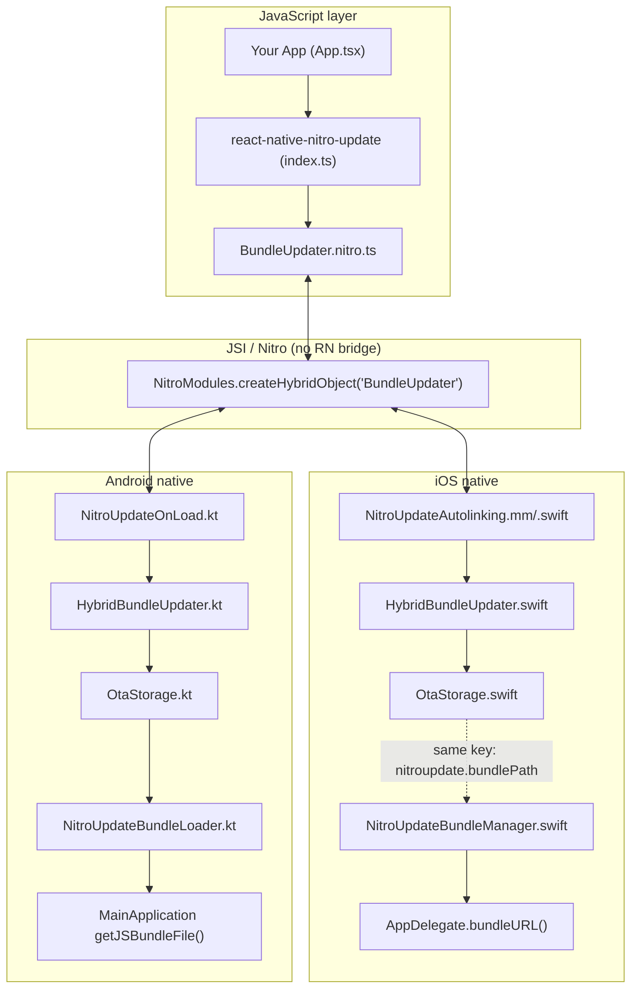
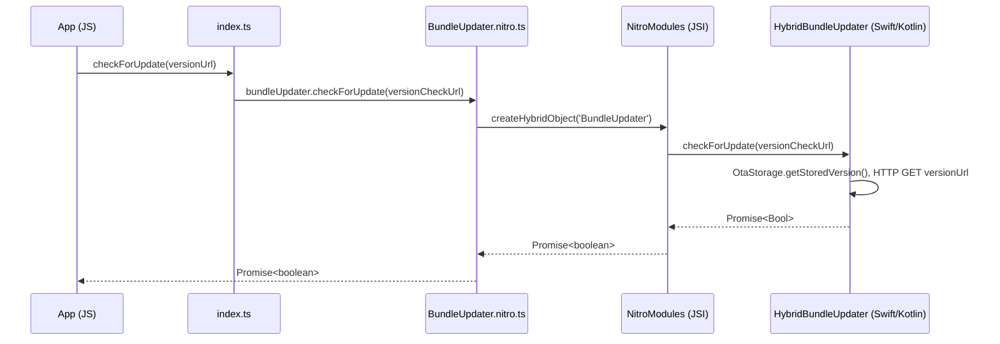

# react-native-nitro-update — Architecture, flow & file map

This document describes how the library works end-to-end: JS ↔ native bridge, native file roles, storage keys, and the OTA lifecycle. Use it to debug, onboard, or integrate the library.

**Diagrams:** Mermaid blocks render on GitHub and in many Markdown viewers (e.g. VS Code with a Mermaid extension).

---

## 1. High-level architecture

### 1.1 Component diagram



### 1.2 Architecture (ASCII)

```
┌─────────────────────────────────────────────────────────────────────────────────┐
│                              YOUR APP (JS)                                        │
│  App.tsx / index.ts                                                               │
│  • checkForUpdate(versionUrl)   • downloadUpdate(downloadUrl)   • reloadApp()    │
│  • confirmBundle()             • getStoredVersion()             • rollback()     │
└─────────────────────────────────────────────────────────────────────────────────┘
                                          │
                          import from 'react-native-nitro-update'
                                          │
                                          ▼
┌─────────────────────────────────────────────────────────────────────────────────┐
│                         react-native-nitro-update (JS)                           │
│  src/index.ts          → re-exports API + lifecycle events                        │
│  src/specs/BundleUpdater.nitro.ts → NitroModules.createHybridObject('BundleUpdater')  │
└─────────────────────────────────────────────────────────────────────────────────┘
                                          │
                              JSI / Nitro (no React Native bridge)
                                          │
                    ┌─────────────────────┴─────────────────────┐
                    ▼                                           ▼
┌───────────────────────────────────┐         ┌───────────────────────────────────┐
│  iOS (Swift)                       │         │  Android (Kotlin)                  │
│  Nitrogen generated + your impl   │         │  Nitrogen generated + your impl    │
│  • NitroUpdateAutolinking.mm/.swift → C++   │  • NitroUpdateOnLoad.kt → libNitroUpdate  │
│  • HybridBundleUpdater.swift      │         │  • HybridBundleUpdater.kt           │
│  • OtaStorage.swift               │         │  • OtaStorage.kt                    │
│  • NitroUpdateBundleLoader.swift  │         │  • NitroUpdateBundleLoader.kt      │
│  • NitroUpdateBundleManager (pod) │         │  • NitroUpdatePackage.kt            │
└───────────────────────────────────┘         └───────────────────────────────────┘
                    │                                           │
                    │  AppDelegate.bundleURL()                   │  getJSBundleFile()
                    │  prefers OTA bundle when present           │  prefers getStoredBundlePath()
                    ▼                                           ▼
┌───────────────────────────────────┐         ┌───────────────────────────────────┐
│  React Native loads JS bundle     │         │  React Native loads JS bundle     │
│  from URL (OTA or main.jsbundle)  │         │  from path (OTA or assets)         │
└───────────────────────────────────┘         └───────────────────────────────────┘
```

---

## 2. JS → Native bridge (Nitro / JSI)

The library uses **Nitro** (react-native-nitro-modules) so JS talks to native via **JSI**, not the legacy React Native bridge.



- **Spec (source of truth for the API):** `src/specs/BundleUpdater.nitro.ts`  
  - Declares the `BundleUpdater` interface and calls `NitroModules.createHybridObject<BundleUpdater>('BundleUpdater')`.
- **Nitrogen** generates platform code from the Nitro spec:
  - **iOS:** `NitroUpdateAutolinking.mm` registers `"BundleUpdater"` and calls `NitroUpdateAutolinking.createBundleUpdater()`, which returns a C++ wrapper around `HybridBundleUpdater` (Swift).
  - **Android:** `NitroUpdateOnLoad.kt` loads `libNitroUpdate`; the Nitro runtime resolves `"BundleUpdater"` to `HybridBundleUpdater` (Kotlin).

So: **JS** → **BundleUpdater.nitro.ts** → **NitroModules (JSI)** → **HybridBundleUpdater (Swift/Kotlin)**.

---

## 3. Native file map and responsibilities

### 3.1 iOS

| File | Role |
|------|------|
| **NitroIsolatedBundle/NitroUpdateBundleManager.swift** | **App-facing, no C++.** Reads `UserDefaults` key `nitroupdate.bundlePath`. Returns stored OTA bundle URL so AppDelegate can choose which bundle to load. **Same key** as `OtaStorage.bundlePathKey` so both the updater and the app see the same path. |
| **ios/OtaStorage.swift** | Shared storage for the **NitroUpdate** pod: version, bundle path, pending validation, blacklist, rollback history, previous bundle (rollback), background check URLs. Uses `UserDefaults` and `Application Support/NitroUpdate/bundles` for extracted bundles. |
| **ios/HybridBundleUpdater.swift** | Implements OTA logic: `checkForUpdate` (fetch version.txt, compare), `downloadUpdate` (download zip, unzip, checksum, save path/version via OtaStorage), `reloadApp` (exit(0)), `confirmBundle`, `rollback`, `markBundleBad`, blacklist/history, background check (BGAppRefreshTask). Conforms to Nitrogen-generated `HybridBundleUpdaterSpec`. |
| **ios/NitroUpdateBundleLoader.swift** | Helper that uses **OtaStorage** (same pod as HybridBundleUpdater) to return the stored bundle URL. Alternative to NitroUpdateBundleManager when you already depend on the main NitroUpdate pod in the same target. |
| **nitrogen/generated/ios/NitroUpdateAutolinking.swift** | Generated. Creates `HybridBundleUpdater()` and exposes it to C++ as `createBundleUpdater()`. |
| **nitrogen/generated/ios/NitroUpdateAutolinking.mm** | Generated. Registers the native module name `"BundleUpdater"` with the Nitro runtime and wires it to the Swift implementation. |
| **nitrogen/generated/ios/swift/HybridBundleUpdaterSpec.swift** | Generated. Protocol + base class for the Swift implementation of `BundleUpdater`. |
| **nitrogen/generated/ios/swift/HybridBundleUpdaterSpec_cxx.swift** | Generated. Swift ↔ C++ bridge for the spec. |

**App integration (example):** In **AppDelegate** you use **NitroUpdateBundleManager** (separate pod, Swift-only) so the app target does not pull in C++. In release, `bundleURL()` returns `NitroUpdateBundleManager.getStoredBundleURL()` when present, else `main.jsbundle`.

### 3.2 Android

| File | Role |
|------|------|
| **NitroUpdateBundleLoader.kt** | **App-facing.** `getStoredBundlePath(context)` reads from **OtaStorage** and returns the stored bundle path if the file exists. Your `MainApplication` / React Native host uses this to choose which JS bundle to load. |
| **OtaStorage.kt** | Shared storage: version, bundle path, pending validation, blacklist, rollback history, previous bundle, background URLs. Uses `SharedPreferences` (name `nitroupdate`) and a bundles directory. Can use `overrideContext` when React isn’t ready (e.g. background worker). |
| **HybridBundleUpdater.kt** | Implements the same OTA API as iOS: check, download, reload, confirm, rollback, markBundleBad, blacklist, history, and schedules `BackgroundUpdateWorker`. Extends Nitrogen-generated `HybridBundleUpdaterSpec`. |
| **BackgroundUpdateWorker.kt** | WorkManager periodic work; runs version check (and optional download) using the same storage and logic as HybridBundleUpdater. |
| **NitroUpdatePackage.kt** | React Native package; in `init` loads native lib via `NitroUpdateOnLoad.initializeNative()`. Does not expose legacy React modules. |
| **nitrogen/generated/android/.../NitroUpdateOnLoad.kt** | Generated. Loads `System.loadLibrary("NitroUpdate")` so the JSI native code is available. |
| **nitrogen/generated/android/.../HybridBundleUpdaterSpec.kt** | Generated. Abstract class that HybridBundleUpdater extends; declares the methods the C++/JSI side calls. |

**App integration:** When creating the React Native host, call `NitroUpdateBundleLoader.getStoredBundlePath(context)` and, when non-null, pass that path as the JS bundle file so the app loads the OTA bundle.

### 3.3 Shared storage keys (iOS OtaStorage ↔ NitroUpdateBundleManager)

So that the **updater** (HybridBundleUpdater + OtaStorage) and the **app** (NitroUpdateBundleManager) agree on “current bundle”:

- **NitroUpdateBundleManager** uses key `nitroupdate.bundlePath` in `UserDefaults`.
- **OtaStorage** uses `OtaStorage.bundlePathKey = "nitroupdate.bundlePath"`.

So both read/write the same path. The app only reads it; the updater writes it after a successful download.

---

## 4. OTA lifecycle (detailed flow)

```mermaid
flowchart TB
  subgraph Launch
    A[App cold start] --> B{Platform: which bundle?}
    B -->|iOS: AppDelegate.bundleURL()| C{OTA path set & file exists?}
    B -->|Android: getJSBundleFile()| C
    C -->|Yes| D[Load JS from OTA path]
    C -->|No| E[Load embedded main.jsbundle / default]
    D --> F[React Native runs JS]
    E --> F
  end

  subgraph JS on mount
    F --> G[confirmBundle - mark current as valid]
    G --> H[After 2s: checkForUpdate versionUrl]
    H --> I{New version?}
    I -->|No| J[Done]
    I -->|Yes| K[downloadUpdate downloadUrl]
    K --> L[Save zip → unzip → OtaStorage.setStoredBundlePath + setStoredVersion]
    L --> M[reloadApp → process exit]
  end

  subgraph Next launch
    M --> N[User opens app again]
    N --> B
  end
```

1. **Launch:** Native decides bundle URL/path (iOS: `NitroUpdateBundleManager.getStoredBundleURL()` or embedded; Android: `NitroUpdateBundleLoader.getStoredBundlePath(context)` or default). React Native loads that bundle and runs JS.
2. **JS on mount:** App calls `confirmBundle()` so the current bundle is marked valid (rollback guard). After a short delay, it calls `checkForUpdate(versionUrl)`. If the remote version is newer, it calls `downloadUpdate(downloadUrl)`. Native downloads the zip, unzips, and writes version + bundle path to **OtaStorage** (and on iOS the same path is read by **NitroUpdateBundleManager**).
3. **Apply:** If you call `reloadApp()`, the process exits. On the **next** cold start, native again resolves the bundle URL/path and this time returns the new OTA path, so the new bundle runs.

---

## 5. Data flow: version and bundle path

```mermaid
flowchart LR
  subgraph Remote
    V[version.txt]
    Z[bundle.zip]
  end

  subgraph Native
    subgraph OtaStorage
      KV[version key]
      KP[bundlePath key]
    end
    subgraph NitroUpdateBundleManager
      KP2["bundlePath key (same)"]
    end
  end

  subgraph App delegate
    BD[bundleURL() / getJSBundleFile()]
  end

  checkForUpdate --> V
  downloadUpdate --> Z
  Z --> unzip
  unzip --> KP
  V --> KV
  KP --> KP2
  KP2 --> BD
  BD --> RN[React Native load bundle]
```

- **Version:** Fetched from `versionUrl`, compared with `OtaStorage.getStoredVersion()`, then after a successful download the new version is stored via `OtaStorage.setStoredVersion(...)`.
- **Bundle path:** After unzip, the chosen bundle file path is stored via `OtaStorage.setStoredBundlePath(...)`. On iOS, **NitroUpdateBundleManager** reads the same key and returns that path as the bundle URL for the next launch.

---

## 6. File tree (key files only)

```
packages/react-native-nitro-update/
├── src/
│   ├── index.ts                    # Public JS API, re-exports
│   ├── specs/
│   │   └── BundleUpdater.nitro.ts # Nitro spec: createHybridObject('BundleUpdater')
│   ├── githubOTA.ts
│   ├── updateManifest.ts
│   ├── useOTAUpdate.ts
│   └── silentUpdate.ts
├── ios/
│   ├── HybridBundleUpdater.swift  # OTA logic (check, download, reload, confirm, rollback)
│   ├── OtaStorage.swift           # UserDefaults + bundles dir
│   ├── NitroUpdateBundleLoader.swift
│   └── Bridge.h
├── NitroIsolatedBundle/
│   └── NitroUpdateBundleManager.swift  # AppDelegate: getStoredBundleURL() (same key as OtaStorage)
├── android/src/main/java/.../nitroupdate/
│   ├── HybridBundleUpdater.kt
│   ├── OtaStorage.kt
│   ├── NitroUpdateBundleLoader.kt # getStoredBundlePath(context)
│   ├── NitroUpdatePackage.kt
│   └── BackgroundUpdateWorker.kt
└── nitrogen/generated/
    ├── ios/
    │   ├── NitroUpdateAutolinking.swift   # createBundleUpdater()
    │   ├── NitroUpdateAutolinking.mm      # Register "BundleUpdater"
    │   └── swift/
    │       ├── HybridBundleUpdaterSpec.swift
    │       └── HybridBundleUpdaterSpec_cxx.swift
    └── android/.../
        ├── NitroUpdateOnLoad.kt           # loadLibrary("NitroUpdate")
        └── HybridBundleUpdaterSpec.kt
```

---

## 7. Summary

| Layer | What it does |
|-------|----------------|
| **JS (your app)** | Calls `checkForUpdate`, `downloadUpdate`, `reloadApp`, `confirmBundle`, etc. |
| **BundleUpdater.nitro.ts** | Defines the API and creates the JSI hybrid object `'BundleUpdater'`. |
| **Nitro / JSI** | Resolves `'BundleUpdater'` to the native implementation (Swift or Kotlin). |
| **HybridBundleUpdater** | Implements check, download, unzip, checksum, reload, confirm, rollback, blacklist, background check. |
| **OtaStorage** | Persists version, bundle path, rollback data, blacklist, background URLs. |
| **NitroUpdateBundleManager (iOS)** / **NitroUpdateBundleLoader (Android)** | Expose “current OTA bundle path/URL” to the app so the **next** launch loads the new bundle. |
| **AppDelegate (iOS)** / **MainApplication (Android)** | Choose which bundle to load: OTA path when present, else embedded/default. |

The OTA **download** happens in JS-triggered native code; the OTA **apply** happens on the **next** cold start, when the native bundle loader returns the stored OTA path.
